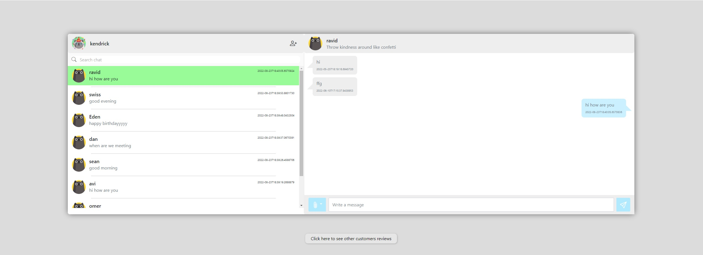

# Chat web client

Real time Chat app in web that inculdes both client and server side.  
The chat client can be used with both web and android that can communicate with each other thanks to the server.  
The web client was built using react and css.  
The web client side consists 3 pages: Login, Signup, Chat.  

## How to run  
The client and server sides need to be run separately.    
First the server needs to be run and then the client.    
When both of them are running the client and server will be able to communicate with one another.  
The client will be able to send and recieve information from the server's database,  
In addition the server will be able to send asynchronous notifications to the client-side with signalR.  
  
### How to run the web client  

#### `git clone`  

Clone the repository:   
Open your preferred IDE,    
Write the following line in the terminal:   
git clone https://github.com/Rittaki/Chat-React.git  

#### `download the needed packages`  

Write the following line in the terminal:   
npm i  
This will automatically download the necessary dependencies of the project.   
In addition write the following line in the terminal:  
npm install @microsoft/signalr  
This will enable signalr in the client.  

#### `run project`  

Run the project with "npm start"   

## How to use the app  

When you first open the app, you will see the login page  
At first the database will be empty of users.  
In order to add a user go over to the signup page and sign up.  
After signing up you will be directed directly to the chat page.  
In order to start a conversion you will need to sign up another user.  
Then you will be able to add each other and enjoy real time chat.  
However, if you choose to add users manualy to the entity framework database please notice the following instructions:  
1. In the User Table the id property must be the same as the username property (done automatically when signing up)  
2. In the Contact Table the id propery will function as the contact's Username  
3. In the Contact Table The UserId is required and will function as the UserName of the user which the contact belong to.  

##

